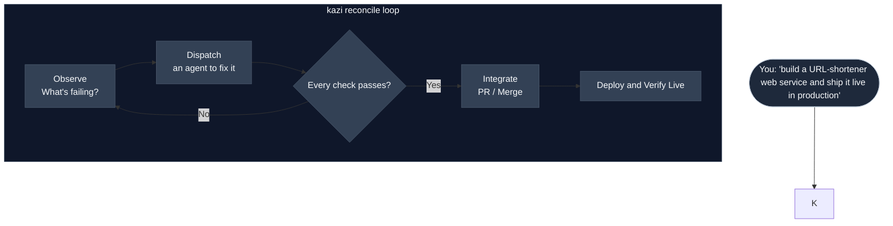
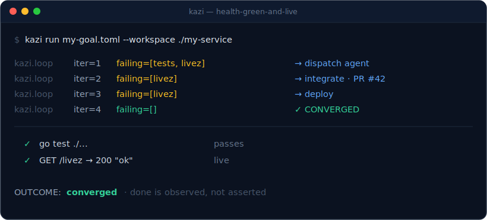

<p align="center">
  <picture>
    <source media="(prefers-color-scheme: dark)" srcset="assets/logo/kazi-wordmark-dark.svg">
    
  </picture>
</p>

<p align="center">
  <a href="https://kazi.sire.run"><b>Website</b></a> &nbsp;&middot;&nbsp;
  <a href="docs/concept.md">Concept</a> &nbsp;&middot;&nbsp;
  <a href="https://github.com/kazi-org/kazi/releases">Releases</a> &nbsp;&middot;&nbsp;
  <a href="https://github.com/kazi-org/homebrew-tap">Homebrew tap</a>
</p>

<p align="center">
  
  <a href="https://github.com/kazi-org/kazi/releases/latest"></a>
  
  <a href="https://github.com/kazi-org/kazi/actions/workflows/ci.yml"></a>
</p>

# kazi

**Your coding agent says "done." kazi proves it.**

*kazi* (Swahili: *work / a job*) is **the outer/reconciliation loop for coding agents**.
You tell it the outcome you want — in plain English or as a short goal-file — and
kazi drives a coding agent (Claude Code, Codex, …) in a loop until that outcome is
*objectively* real: tests pass, the endpoint is live, the change is deployed. If it
can't get there, it stops and tells you why (stuck, or out of budget) instead of
pretending it's finished.

Think of it like **Kubernetes for coding goals**: you declare desired state, kazi
watches actual state, and it keeps closing the gap until the two match.



That loop on a real goal — *"tests pass **and** the deployed `/livez` returns ok"* —
drives the failing predicates to zero and only then reports done:

<p align="center">
  
</p>

It is **not** another coding agent, terminal, or IDE. kazi *drives* the agent you
already use. As that agent gets better, kazi gets better for free.

---

## Why kazi?

Two problems nobody else owns:

1. **"Done" is the agent's opinion.** A coding agent stops when it *thinks* it's
   finished — even when the work is merely plausible. kazi makes "done" objective:
   the loop can only succeed when *every* check (kazi calls them **predicates**)
   evaluates true, with stored evidence. Truth lives in the controller, not the agent.
2. **Parallel agents collide.** Locking a *task* doesn't stop two agents editing the
   *same files*. kazi coordinates on **resources** — an agent leases its "blast
   radius" before touching code — so concurrent runs converge instead of conflict.
3. **Bring Your Own Model (BYOM) & Privacy.** Use cloud models or run entirely locally. Wire kazi to a local model (e.g., Llama 3, Qwen) via `opencode` for zero data leaks. Your code and context never leave your hardware.

> **Why now?** Coding agents are finally good enough to do real work — ship
> features, fix bugs, wire up tests. That is exactly *why* kazi exists: once
> agents act autonomously, you need a **controller above them** to decide when
> they are truly done. That layer didn't exist until now, and it's precisely what
> kazi is.

---

## The 60-second mental model

A **goal** is just a list of checkable statements plus a budget:

- **predicates** — the checks that define "done": `the unit tests pass`, `GET /health
  returns 200 ok`, `the production error rate is 0 over 30m`, …
- a **budget** — a hard ceiling (iterations / wall-clock / tokens) so it can never
  run forever or burn money.
- a **scope** — the repo + paths agents are allowed to touch.

kazi loops: **observe** every predicate → the failing ones *are* the to-do list →
**dispatch** an agent to fix them → **integrate** (open a PR, rebase-merge) →
**deploy** → **re-check**. It stops only when all predicates are true (`converged`),
the same checks keep failing (`stuck` → escalate to you), or the budget runs out.

---

## With kazi vs. without

| Without kazi | With kazi |
|---|---|
| *"The agent says it's done."* You trust it on faith. | **Every predicate verified true**, with stored evidence. Truth lives in the controller, not the agent. |
| Two parallel agents edit the same files → merge conflicts. | Agents **lease their blast radius** first — disjoint work runs free, overlapping work serializes. |
| Green tests on a laptop, broken in production. | A **live predicate** probes the *deployed* endpoint. Green-on-my-machine is never enough. |
| It stops when it *feels* finished. | It stops only on `converged`, `stuck`, or `over-budget` — and tells you which. |

---

## Drive kazi from your coding agent

You don't operate kazi directly — your coding agent does. Teach Claude Code the
kazi skill once, then hand it work in plain language:

```sh
kazi install-skill   # writes the kazi skill to ~/.claude/skills/kazi (opt-in)
```

Then, in your normal Claude Code session, just say:

> **have kazi drive this until done**

The agent recognizes the phrase, authors the acceptance predicates with `kazi
plan`, and runs `kazi apply` until they are *objectively* true — the same way
`use context7` pulls Context7 into a session. (It's a trigger on the kazi skill,
so the phrase only routes to kazi once the skill is installed.)

---

## What a coding agent says

> *"Left to myself, I'll tell you a task is done the moment the code looks
> right. kazi won't let me — it holds the predicates and re-checks them against
> reality, so I stop claiming 'done' when it isn't. I end up shipping the thing
> you actually asked for, not the thing I hoped was finished."*
>
> — Claude (Anthropic), describing kazi in its own words. Agent-authored, kept
> verbatim and labelled as such — not a human testimonial.

---

## Who it's for

- **Builders who ship fast but need reliability** — if an agent has ever
  "finished" something that wasn't actually done, objective termination is the
  guardrail against plausible-but-broken output.
- **Teams running parallel coding agents** — resource leases coordinate who edits
  what *before* any file changes, so concurrent runs converge instead of collide.
- **Engineers who refuse "works on my machine"** — predicates can verify the live,
  deployed system, not just the local checkout.

**Not for you (yet) if:** you want an agent to decide *what* to build — that's your
call; kazi only drives toward an outcome you declare. It also needs a coding
harness (`claude`, `opencode`, …) on your `PATH`; kazi drives one, it isn't one.

---

## Install

The fastest way — a single self-contained binary via Homebrew (no Erlang
prerequisite; ERTS and the SQLite NIF are bundled, so you get the full read-model):

```sh
brew install kazi-org/tap/kazi
kazi --help
```

Prebuilt binaries are published for **Apple Silicon macOS** and **x86_64 Linux**
on each [GitHub Release](https://github.com/kazi-org/kazi/releases) (Intel macOS
and ARM Linux are not yet built — build from source, below). The binary is a
Burrito wrap of a `mix release` ([ADR-0014](docs/adr/0014-binary-distribution-burrito-homebrew.md)),
so unlike the escript it carries the native `exqlite` NIF and persists every
iteration.

> **Runtime requirement:** kazi DRIVES a coding agent ([ADR-0001](docs/adr/0001-positioning-outer-loop-reconciler.md));
> it does not bundle one. A harness binary — `claude` (default) or `opencode` —
> must be on your `PATH` to actually run a goal.

To build from source instead, you need **Elixir / Erlang** (OTP 26+) and `mix`,
plus **git** (kazi commits/opens PRs in your target repo) and *(optional, for live
deploys)* **gcloud** / a deploy command and `gh`:

```sh
git clone https://github.com/kazi-org/kazi && cd kazi
mix deps.get
mix test          # ~850 hermetic tests, should be green
```

Two ways to invoke kazi (same behavior):

```sh
# Mix task — recommended. Boots the full app and persists every iteration to a
# local SQLite read-model (created + migrated automatically on first run).
mix kazi.apply <goal-file> --workspace <path-to-your-project>

# Or build a standalone binary:
mix escript.build          # produces ./kazi
./kazi apply <goal-file> --workspace <path-to-your-project>
./kazi --help
```

### Use a different coding harness

`claude` (Claude Code) is the **default** harness — if you do nothing, kazi
shells out to `claude` exactly as before. But kazi drives whatever CLI coding
agent you already have installed and configured; it does not reimplement provider
plumbing ([ADR-0016](docs/adr/0016-generic-harness-profiles.md)). Pick another
harness per-run with a flag:

```sh
kazi apply <goal-file> --workspace <path> \
  --harness opencode --model local-ollama/qwen3.6:35b-a3b
```

`--harness <id>` selects the harness (`claude`, `opencode`, `codex`,
`antigravity`, or `claw` today — see the [tier table](#tiered-harness-support-adr-0022)
below); `--model <provider/model>` selects the model that harness should use.

**Point opencode at a local model (e.g. a locally-hosted Qwen3.6).** If you run
[`opencode`](https://opencode.ai) wired to a local model (for example a
**Qwen3.6 35B-A3B** on a local GPU host), **opencode's own provider config
is the source of truth** for the endpoint and credentials. `--model` is
opencode's `provider/model` string — the provider (`local-ollama` above) and its
base URL live in your opencode config, not in kazi. kazi can also forward
provider/endpoint environment variables to the harness subprocess when a local
setup expects them — declare them as the harness `:env` and kazi passes them
straight through to the underlying call.

#### A per-goal or global default

You don't have to pass `--harness`/`--model` on every run. A goal-file can carry
its own preferred harness in an optional `[harness]` table:

```toml
[harness]
id = "opencode"                            # a KNOWN harness id (claude / opencode / codex / antigravity / claw)
model = "local-ollama/qwen3.6:35b-a3b"       # optional provider/model override
command = "opencode"                       # optional binary override
```

Or set a machine-wide default in app config:

```elixir
# config/config.exs
config :kazi, :harness, :opencode
```

kazi resolves the harness with a fixed **precedence** (highest first):

1. the **`--harness` / `--model` CLI flags**;
2. the goal-file **`[harness]` table**;
3. the **app config** `config :kazi, :harness`;
4. the default, **`claude`**.

So a CLI flag always wins; absent every layer, kazi drives `claude`.

#### Add a harness = declare a profile

There is no new adapter module per harness. A harness is a **profile** — a value
in [`Kazi.Harness.Registry`](lib/kazi/harness/registry.ex) built from
[`Kazi.Harness.Profile`](lib/kazi/harness/profile.ex): a `command`, an argv
renderer (`build_args`), and a stdout parser (`parse`), plus the set of optional
flags the harness understands. One generic adapter (`Kazi.Harness.CliAdapter`)
runs every profile. Adding `codex`, `gemini-cli`, etc. is profile DATA — often
reusing an existing parser — not a new module; a fully custom harness can be
declared in config without touching kazi.

> **Runtime requirement.** The chosen harness binary (`claude`, `opencode`, …)
> must be installed and on your `PATH`. kazi shells out to it as a subprocess; it
> does not bundle or install harnesses.

#### Tiered harness support (ADR-0022)

Not every CLI agent clears the same bar. kazi drives every harness as a
non-interactive subprocess and parses its stdout, so a harness is **first-class**
only when it runs from a single prompt AND emits machine-parseable output
(JSON/JSONL) correctly under a non-TTY subprocess
([ADR-0022](docs/adr/0022-harness-onboarding-conformance.md)). Some tools are
added with a documented workaround, and one is **best-effort only**:

| Harness (`--harness`) | Tier | Notes |
| --- | --- | --- |
| `claude` (default) | First-class | single JSON envelope; full cost/token parse. |
| `opencode` | First-class | NDJSON event stream; point it at a local model. |
| `codex` | First-class | `codex exec … --json` JSONL stream; auth `OPENAI_API_KEY` / `codex login`. |
| `antigravity` | Conformant **with a workaround** | non-TTY stdout bug (`antigravity-cli#76`) handled via `--prompt-file --output json`; auth `GEMINI_API_KEY` / `ANTIGRAVITY_API_KEY`. |
| `claw` | **Best-effort / demo-grade** | claw-code emits **no** structured output and has no model flag — kazi surfaces its raw stdout as the result with **no cost/token extraction**. It runs, but fidelity is degraded; treat it as a demo ("an agent-managed museum exhibit, not a production tool"), not a budgeted production run. Auth is via env API keys (`ANTHROPIC_API_KEY` / `OPENAI_API_KEY`). |

### Build a self-contained release (full read-model)

The escript can't bundle the native SQLite NIF, so it runs **without** the
read-model. A `mix release` bundles ERTS *and* the compiled NIFs, so the released
binary has the **full read-model** (and is the foundation the per-platform binary
is built from — see [ADR-0014](docs/adr/0014-binary-distribution-burrito-homebrew.md)):

```sh
MIX_ENV=prod mix release --overwrite     # builds _build/prod/rel/kazi

# The CLI is invoked through the release's `eval` command, which propagates the
# CLI's exit code (0 on convergence / a recorded proposal / approval, non-zero
# otherwise) — so the release composes in scripts and CI like the escript:
_build/prod/rel/kazi/bin/kazi eval 'Kazi.Release.cli(["--help"])'
_build/prod/rel/kazi/bin/kazi eval \
  'Kazi.Release.cli(["apply", "<goal-file>", "--workspace", "<path>"])'
_build/prod/rel/kazi/bin/kazi eval 'Kazi.Release.cli(["list-proposed"])'
```

`Kazi.Release.cli/1` dispatches to the same `Kazi.CLI` core as the escript and
`mix kazi.apply`, so every subcommand (`apply` / `plan` / `list-proposed` /
`approve` / `reject` / `--help`) behaves identically.

### Build a single-file native binary (Burrito)

[Burrito](https://github.com/burrito-elixir/burrito) wraps the `mix release`
above into one self-contained per-platform executable that bundles ERTS **and**
the compiled exqlite NIF — so the binary has the **full SQLite read-model** with
no Erlang prerequisite on the user's machine (T6.2, [ADR-0014](docs/adr/0014-binary-distribution-burrito-homebrew.md)).
The `kazi` release declares four targets: macOS `aarch64`/`x86_64` and Linux
`aarch64`/`x86_64`.

Building requires [Zig](https://ziglang.org) **0.15.2** (Burrito's pinned
version) and `xz` on `PATH`; cross-target builds also need `7z` for Windows
(kazi ships no Windows target). Build the host target and run it:

```sh
# Build the binary for the current host platform (set BURRITO_TARGET to one of
# macos_aarch64 / macos_x86_64 / linux_aarch64 / linux_x86_64; omit it to build
# every declared target). Output lands in ./burrito_out/.
BURRITO_TARGET=macos_aarch64 MIX_ENV=prod mix release --overwrite

# The wrapped binary takes the CLI args directly — no `eval`. It reads them via
# Burrito's argv and dispatches through the same Kazi.CLI core:
./burrito_out/kazi_macos_aarch64 --help
./burrito_out/kazi_macos_aarch64 apply <goal-file> --workspace <path>
./burrito_out/kazi_macos_aarch64 list-proposed
```

The binary persists its read-model to `$KAZI_DB` if set, otherwise
`~/.kazi/kazi.db` (created on first run; see `config/runtime.exs`). Unlike the
escript, every iteration and proposal is persisted — the NIF is bundled.

> **macOS 26 + Zig note.** Burrito 1.5.0 pins Zig **0.15.2**, which cannot link
> native binaries against the macOS 26 SDK (Xcode 26); Zig 0.16 links it but is
> API-incompatible with Burrito's `build.zig`. On a macOS 26 host the wrap step
> fails at the Zig link; build the macOS binaries on a macOS 15 (or earlier)
> runner — which is what the release CI matrix (T6.3) targets.

---

## Quickstart 1 — describe what you want in plain English

You don't have to write a goal-file by hand, and you don't have to break the work
down yourself. Tell kazi the *app* (or feature) you want — as high-level as
"build an X" — and it drafts the machine-checkable predicates that define "done"
for you (using your coding agent), then holds them for your review. **Nothing runs
until you approve**, and you can trim or edit what it drafted:

```sh
# 1. Describe the app you want. In a terminal, kazi asks a few sharp clarifying
#    questions FIRST (so "done" is precise — especially the live-verification
#    target), then drafts the acceptance predicates and an inline rationale:
kazi plan "create a URL-shortener web service" --workspace ./shortener
#
#   A few questions to make the goal precise (press Enter for the default):
#   What is the live-verification target for this goal?
#     1) A deployed URL probed over HTTP *
#     2) Production logs / a runtime signal
#     3) None for now — green tests are enough
#   > 1
#   ...
#   PROPOSED  proposal=prop-url-shortener-3f9c1a2b  goal=url-shortener
#     • go test ./... passes
#     • POST /shorten returns 201 with a short code for a submitted URL
#     • GET /<code> redirects (302) to the original URL
#     • GET / renders a form to submit a URL
#   rationale: probe the deployed shortener over HTTP; auth is out of scope for v1

# 2. Review what it drafted (you're the approver — agents propose, humans dispose).
#    Too much? Too little? Refine inline with a sharper sentence when prompted.
kazi list-proposed
#   prop-url-shortener-3f9c1a2b   proposed   url-shortener   (4 predicates)

# 3. Approve the goal you want kazi to pursue:
kazi approve prop-url-shortener-3f9c1a2b
#   APPROVED   proposal=prop-url-shortener-3f9c1a2b  goal=url-shortener
#   The goal is now runnable: kazi apply <goal-file> --workspace <path>
```

The clarify phase is a HYBRID (ADR-0019): a deterministic floor of gap-checks kazi
always runs (it insists on a live-verification target and a scope boundary) plus
questions your coding agent drafts for the specific idea. Scripting it? `--yes` (or
any non-TTY pipe) skips the questions and drafts best-effort; `--strict` refuses an
underspecified idea instead of guessing; `--adr` also writes an ADR-lite rationale
doc under `docs/adr/`.

`plan` / `approve` are the natural-language **front door** (an agent drafts,
a human approves — the only write path the dashboard shares too).
The higher-level the idea, the more predicates kazi drafts — and the more you'll
want to curate them before approving, because every predicate becomes a wall kazi
won't declare "done" until it's objectively true. Approving blesses the goal; to
drive it, hand `kazi apply` a goal-file (next section) — the same predicates, captured
as a file you can version and re-run.

> More "build an app for X" ideas kazi can draft predicates for:
> - `kazi plan "create a paste-bin app with a create-paste API and a raw view"`
> - `kazi plan "build a webhook receiver that validates signatures and stores events"`
> - `kazi plan "create a REST API for a to-do list with the usual CRUD endpoints"`

---

## Quickstart 2 — write a tiny goal-file and ship it

A goal-file is a few lines of TOML. Here's one that says *"the unit tests pass AND
the deployed `/livez` endpoint returns `ok`"* — code **and** live production, in one
declaration:

```toml
# my-goal.toml
id = "health-green-and-live"
name = "health endpoint returns ok, tests green and live"

[budget]
max_iterations = 8        # hard ceilings — kazi can never loop forever
max_tokens = 500000

[scope]
workspace = "."           # the repo kazi may edit
paths = ["main.go"]

# A CODE check: the project's tests must pass.
[[predicate]]
id = "tests"
provider = "test_runner"
description = "unit tests pass"
cmd = "go"
args = ["test", "./..."]

# A LIVE check: the *deployed* service must answer correctly. This is what makes
# convergence real — green-on-my-laptop is not enough.
[[predicate]]
id = "livez-live"
provider = "http_probe"
description = "deployed GET /livez returns 200 body \"ok\""
url = "https://your-service.run.app/livez"
expect_status = 200
expect_body = "ok"
body_match = "exact"      # exact, not substring — "ok" is a substring of "not-ok"!
```

Run it:

```sh
mix kazi.apply my-goal.toml --workspace ./my-service
```

kazi prints each iteration and a final verdict, and exits `0` only on convergence:

```
kazi.loop goal=health-green-and-live iter=1 failing=["tests","livez-live"]   → dispatch agent
kazi.loop goal=health-green-and-live iter=2 failing=["livez-live"]           → integrate (PR #42)
kazi.loop goal=health-green-and-live iter=3 failing=["livez-live"]           → deploy
kazi.loop goal=health-green-and-live iter=4 failing=[]                       → CONVERGED ✓
OUTCOME: :converged   (tests pass · live /livez = "ok")
```

**Predicate providers** you can use today:

| `provider`     | checks… | key config |
|----------------|---------|------------|
| `test_runner`  | a command's exit code (unit/integration tests) | `cmd`, `args` |
| `http_probe`   | a live URL's status + body, optionally **sustained** over N samples | `url`, `expect_status`, `expect_body`, `body_match`, `samples`, `interval_ms` |
| `browser`      | a real browser flow (Playwright), optionally a **journey** over N runs | per-flow config, `samples` |
| `prod_log`     | a production-log condition (e.g. 5xx rate) — a coarse safety net | per-check config |
| `metrics`      | a live **RED/SLO** signal (PromQL): windowed quantile, error-rate, or **burn-rate** gate | `query_url`, `query`, `pass_when`, `quantile`, `burn_rate` |
| `custom_script`| ANY CLI checker (scanner, mutation tester, contract check) | `cmd`, `args`, `verdict`, `path`, `pass_when` |
| `ratchet`      | a metric may not regress vs a baseline (coverage, perf, size) | `metric`, `baseline`, `direction`, `allowed_regression` |

`custom_script` is the **escape hatch**: it turns any command-line tool into a
predicate without a kazi release. Crucially the **verdict is declared, not
assumed** — a SARIF/JSON scanner that exits `0` *with* findings is gated on its
parsed output, not its exit code (the class of "the gate silently passed" bug,
designed out). See [`docs/custom-script-provider.md`](docs/custom-script-provider.md),
`kazi schema custom_script`, and the recipes in
[`priv/examples/`](priv/examples/) (`custom_script_sarif.toml`,
`custom_script_junit.toml`, `custom_script_mutation.toml`).

`ratchet` is the **no-regression** mode: a metric passes only while it stays
within `allowed_regression` of a `baseline`, read through `direction`
(`higher_better` for coverage/mutation score, `lower_better` for size/latency).
The baseline is a fixed number, the metric's own stored prior value (`"stored"` —
seeded on the first run, tightened on every pass), or a **git ref** (`"main"` —
the metric recomputed at that ref). Coverage, perf, and size are configs of this
one mode. With `allowed_regression = 0` a metric "may only improve." See
[`docs/ratchet-predicate.md`](docs/ratchet-predicate.md), `kazi schema ratchet`,
and the recipes in [`priv/examples/`](priv/examples/) (`ratchet_coverage.toml`,
`ratchet_size.toml`).

The **live providers** (`http_probe` sustained-health, `browser` journeys,
`metrics`, `prod_log`) verify a *deployed* service. The discipline they enforce:
**never converge on a single sample** — `http_probe` and `browser` require N
*consecutive* healthy samples (the Kubernetes `failureThreshold` model), and a
`metrics` burn-rate gate fires only when both a long and a short window breach.
Absent a metrics endpoint, `metrics` degrades to *not applicable* (never a false
pass). See [`docs/live-providers.md`](docs/live-providers.md) and
`kazi schema http_probe` / `kazi schema browser` / `kazi schema metrics`.

Add `guard = true` to a predicate to make it an **invariant** (e.g. "coverage must
not drop") — kazi blocks the "delete the failing test" shortcut.

---

## A real worked example: failing test → live production

This is kazi's own end-to-end proof (the **T0.12 dogfood**), and you can read it in
[`docs/devlog.md`](docs/devlog.md). The fixture in
[`fixtures/deploy-target/`](fixtures/deploy-target/) is a tiny Go web service whose
`/livez` endpoint returns `"not-ok"` and whose unit test therefore **fails on
purpose**. Given the goal *"tests pass AND deployed `/livez` returns ok"*, kazi:

1. **Observed** both checks failing — and refused to call it done.
2. **Dispatched** a `claude -p` agent, which made the one-line fix.
3. **Integrated** it — opened a PR and rebase-merged it to `main`.
4. **Deployed** the new build to Cloud Run.
5. **Re-checked** the live endpoint → `200 "ok"` → **converged**.

Crucially, through steps 1–4 the live check kept failing and kazi **stayed
non-converged** — it only reported success once the real, deployed endpoint was
correct. That's the whole point: done is observed, not asserted.

> Live deploys need a deploy target configured (the service / project / region and a
> deploy command). The fixture's setup — GCP roles, the Cloud Run quirks kazi
> discovered, and the goal-file — is documented in
> [`fixtures/deploy-target/README.md`](fixtures/deploy-target/README.md) and
> [`docs/lore.md`](docs/lore.md).

---

## Adopt an existing project

Already have a working repo? `kazi init <repo-dir>` reverse-engineers a starter
goal-file — the equivalent of `terraform import` for "what already works"
([ADR-0013](docs/adr/0013-adopt-reverse-engineer-goals.md)):

```sh
kazi init ./my-service --out my-service.goal.toml
```

It detects the stack from marker files (`go.mod` → `go test ./...`, `mix.exs` →
`mix test`, `package.json`'s test script, `pyproject.toml`/`setup.cfg` →
`pytest`) and writes one baseline goal-file with:

- a **`test_runner` predicate** naming the detected test command, so kazi holds
  the suite green;
- conservative **guards** (e.g. a coverage ratchet when a coverage tool is
  configured) — never a guard it cannot evaluate;
- a **commented live-predicate TODO** — an `http_probe` scaffold for you to point
  at the real deployed endpoint. Live predicates are scaffolded, never guessed.

Detection is deterministic: the same repo always produces the same goal-file.
Pass `--enrich` (off by default) to have your coding agent propose live
predicates from discovered endpoints; the deterministic detection always stands.
Review the goal-file, fill in the live TODO, then `kazi apply` it.

### Worked example

Run it against the Go fixture that ships with this repo:

```sh
kazi init fixtures/deploy-target --out my.goal.toml
```

It detects the `go.mod` and writes
[`priv/examples/adopt_deploy_target.goal.toml`](priv/examples/adopt_deploy_target.goal.toml):

```toml
id = "adopt-deploy-target"
name = "Adopted baseline for deploy-target"
[scope]
workspace = "fixtures/deploy-target"

[[predicate]]
id = "tests-pass"
provider = "test_runner"
description = "project test suite passes"
args = ["test", "./..."]
cmd = "go"

# ... a `tests-pass-baseline` guard, then a COMMENTED live-predicate TODO
# you uncomment and point at the real deployed endpoint.
```

The acceptance predicate names the detected `go test ./...`; the live predicate
is left as a commented scaffold for you to fill in. A hermetic end-to-end test
pins this output, so the example never drifts from what the tool produces.

---

## Watch it work

- **LiveView dashboard** — a goal board, live agent presence, the lease map, and
  per-goal convergence history. Read-only inspection, decoupled from the loop
  ([ADR-0011](docs/adr/0011-slice3-operator-surfaces.md)).

---

## CLI reference

```
kazi init <repo-dir> [--out <file>] [--enrich]    # adopt a repo -> a goal-file
kazi plan "<idea>" [--workspace <path>]   # draft predicates from plain English
kazi list-proposed [--status <state>]        # review drafts (proposed/approved/rejected)
kazi approve <proposal-ref>                  # bless a drafted goal
kazi reject  <proposal-ref>                  # discard a draft
kazi apply <goal-file> --workspace <path>      # drive a goal to convergence
        [--env <name>]                       #   target a deploy environment (staging/prod)
        [--standing]                         #   run continuously (re-converge on drift)
kazi --help
```

`kazi apply` exits `0` on convergence, non-zero otherwise — so it composes in CI/scripts.

> **Read-model note.** The Mix task (`mix kazi.apply`) creates and migrates the SQLite
> read-model on startup, so every iteration is persisted. The standalone escript
> can't bundle the native SQLite NIF, so it runs without persistence (it still
> converges; it just won't record history).

---

## How it works (under the hood)

- **Positioning** — a harness-agnostic outer loop, never a harness ([ADR-0001](docs/adr/0001-positioning-outer-loop-reconciler.md)).
- **Goals** — machine-checkable predicate sets, evidence-backed ([ADR-0002](docs/adr/0002-goals-as-predicates.md)).
- **Runtime** — Elixir / OTP + Phoenix LiveView ([ADR-0003](docs/adr/0003-language-elixir-otp.md)); one supervised process per active goal.
- **Coordination** — NATS JetStream KV leases (revision-CAS + TTL) and graph-aware blast-radius partitioning ([ADR-0004](docs/adr/0004-coordination-substrate-nats-jetstream.md), [ADR-0006](docs/adr/0006-coordination-leases-and-graph-partitioning.md)).
- **Data split** — Git (code) · JetStream (coordination) · ETS (live state) · SQLite (read-model) ([ADR-0005](docs/adr/0005-data-layer-split.md)).
- **Harness & context** — stateless per iteration; kazi owns context as a thin, deterministic evidence projection plus a blast-radius orientation pack — never conversation memory ([ADR-0008](docs/adr/0008-harness-invocation-and-context.md), [ADR-0009](docs/adr/0009-prompt-construction-thin-evidence-projection.md), [ADR-0010](docs/adr/0010-context-injection-reexploration-mitigation.md)).

Full narrative: [`docs/concept.md`](docs/concept.md). Decisions: [`docs/adr/`](docs/adr/).
Build plan: [`docs/plan.md`](docs/plan.md).

---

## Status

Slices 0–3 are implemented and green (Elixir/OTP; ~700 hermetic ExUnit tests), and
the live idea → production loop is proven end-to-end (the T0.12 dogfood above). What
works today:

- **Convergence core** — the reconcile loop drives predicates to truth via a
  stateless agent harness plus integrate (branch → PR → rebase-merge) and deploy
  actions; evidence persisted to SQLite.
- **Trustworthy loops** — regression detection, flake quarantine, hard budgets,
  stuck-escalation, and a production-log predicate.
- **Creation mode** — kazi builds *new* features from failing acceptance predicates,
  not only repairs. From here on, kazi builds kazi.
- **Coordination & surfaces** — NATS leases + presence, graph partitioning,
  natural-language authoring, and a LiveView dashboard.
- **Context injection** — every stateless iteration starts *oriented* (a
  deterministic blast-radius pack + an optional, off-by-default retrieval adapter),
  without reintroducing conversation memory.

**By design, kazi will never**: become a coding agent/harness; decide *what* to
build (that's your judgment); or put a vector DB in the core loop (the retrieval
adapter is an optional augmentation, never the foundation).

## Community & help

Questions? Start a [GitHub Discussion](https://github.com/kazi-org/kazi/discussions) | Read [`concept.md`](docs/concept.md) for the architecture.

## License

Licensed under the [Apache License, Version 2.0](LICENSE). See the [NOTICE](NOTICE)
file for attribution. Copyright 2026 Sire Run, Inc.

---

<p align="center">
  Built by the team behind <a href="https://sire.run"><b>Sire</b></a>.
</p>
