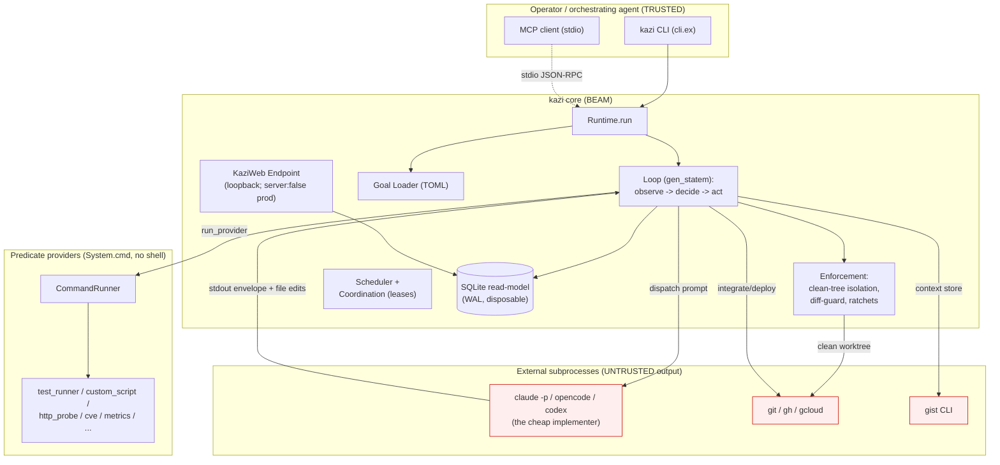

# Deep Review 001 -- kazi (full codebase)

- Date: 2026-07-03 (UTC)
- Scope: full codebase (`lib/`, `config/`, `.github/`, `mix.exs`)
- Reviewed at: `main` @ `588f404` (release 1.72.1)
- Method: manual end-to-end trace of the security-critical surface + 7-partition
  parallel read-only agent sweep of the remaining large modules, followed by
  independent adversarial cross-validation of every Critical/High/Medium finding.
- Posture: READ-ONLY. No production code was changed.

---

## Executive Summary

kazi is a mature, unusually security-conscious Elixir/OTP codebase. It is a **local
CLI reconciliation controller** -- not a network service -- that drives coding agents
in a loop until machine-checkable acceptance predicates pass. Its threat model is
inverted from a typical web app: running arbitrary commands is the *product* (via the
`custom_script`/`test_runner` providers and harness subprocesses), the goal-file author
is trusted, and the untrusted party is the cheap model kazi drives. That model is
respected in the code: **every** subprocess call goes through `System.cmd/3` (execve
with an argv list, no shell), so classic command injection is impossible by
construction; there is no `binary_to_term`, `Code.eval`, `os:cmd`, `sh -c`, or raw SQL
anywhere in `lib/`; the web dashboard is `server: false` in prod and loopback-only in
dev; the MCP server is stdio-only. Overall maturity: **Level 4 (managed/consistent)**.
There are no Critical findings and no leaked secrets.

The three highest-risk findings are functional/integrity issues, not classic security
holes. First (**High, H1**): kazi's flagship anti-gaming feature -- "held-out"
acceptance predicates, hidden from the agent to catch overfitting -- is structurally
unable to converge under the default clean-tree isolation, because the held-out check
runs against committed `HEAD` while the agent's fix lives in the uncommitted working
tree, and the only commit path (`integrate`) is gated on that same check passing. In
plain terms: a documented, default-on quality feature can silently *never* declare
success and instead reports "stuck," burning compute. Second (**Medium, M1**): the
release pipeline downloads the Zig build toolchain over the network with no checksum or
signature check, then builds the binary every user installs -- a compromised mirror
could trojan every release. Third (**Medium, M2**): a corrupted ratchet-baseline file
is indistinguishable from a missing one, so any corruption silently re-seeds the
"may-only-improve" guard at the current (possibly regressed) value, quietly defeating
the anti-gaming ratchet.

The single most impactful architectural recommendation: **the clean-tree isolation must
grade held-out and guard predicates against the agent's actual candidate state, not a
frozen `HEAD`** -- e.g. by isolating the *grader definition* (the test/checker source)
from a clean ref while still running it against the working-copy *inputs*, or by
snapshotting the agent's working tree into the clean worktree. Without this, the two
tamper-resistance features (held-out acceptance + ratchets) are either non-converging
(H1) or blind within the iteration they are meant to police.

## Codebase Maturity Assessment

| Dimension            | Level | Evidence |
|----------------------|-------|----------|
| Security posture     | 4 | All exec via `System.cmd/3` argv (`command_runner.ex:83`, `cli_adapter.ex:126`); no `eval`/`binary_to_term`/raw SQL; dedicated `Kazi.Redaction` on egress paths; anti-gaming isolation (`enforcement/isolation.ex`). Docked for H1/M2 (isolation gaps) + M3 (atom exhaustion). |
| Code quality         | 5 | Small, pure, well-documented functions; explicit `{:ok,_}`/`{:error,_}`; extensive moduledocs that state invariants and cite ADR/lore. |
| Test coverage        | 4 | Every lore-fixed bug has a pinned regression test cited in the moduledocs (e.g. `run_goals_group_parallel_test.exs`, `lease_table_test.exs`); ExUnit + Playwright smoke. Gaps: no test forces H1's deadlock or M4's crash path. |
| Architecture         | 4 | Clean CQRS split (SQLite read-model is disposable, `config.exs:9`); provider/harness behaviours; injectable seams everywhere. Docked for the isolation state-machine gap (H1) and standing-loop unboundedness (M6). |
| Observability        | 3 | Structured read-model + LiveView dashboard + `Plug.RequestId`. No metrics/tracing; some correctness signals disagree with terminal outcome (L10) and the lease dashboard can misreport (L8). |
| Error handling       | 4 | Rigorous `:error`-vs-`:fail` discipline (ADR-0002/0040) is the core value and is enforced centrally. Docked for the unrescued `parse_number!` crash (M4) and the `--json` contract gaps (M9/L2). |
| Dependency hygiene   | 4 | Lean, ADR-gated deps; `mix.lock` committed. Docked for `~>` ranges on `toml` and unpinned GitHub Actions (L3). |
| CI/CD maturity       | 3 | `contents: read`, `pull_request` (not `pull_request_target`), PR title via `env:` (safe). Docked for unverified Zig download (M1) and mutable-tag actions (L3). |
| AI/Agent security    | 4 | No raw LLM calls (subprocess only, L-0009); defensive envelope parsing (`claude.ex:269`); tool/permission least-privilege wiring; budget + max-iterations bound autonomy. Docked for atom exhaustion via inline goal (M3). |
| Privacy/Compliance   | N/A | No PII/PHI/payment data; local single-operator tool. |

**Overall maturity: 4.0 (managed/consistent)**, security and architecture weighted 2x.

## Threat Model Summary

**Top 5 assets:** (1) the developer's workspace + git repo kazi edits; (2) ambient
cloud/API credentials the shelled-out `gcloud`/`gh`/`git` read; (3) the reconcile
**verdict integrity** (a false "converged" ships broken code); (4) the released binary
supply chain (Burrito -> GitHub Release -> Homebrew tap); (5) the local read-model
(low sensitivity, rebuildable).

**Top 5 attack surfaces:** (1) predicate providers that shell out; (2) the goal-file /
inline-goal loader; (3) the anti-gaming enforcement layer; (4) harness stdout parsing
(untrusted agent output); (5) the CI/CD + release pipeline.

**STRIDE findings mapped to discovered issues:**
- Tampering: M2 (ratchet reseed), L5 (baseline in agent-editable tree), M1/L3 (build
  supply chain), H1 (isolation blindness weakens the guard).
- Information Disclosure: L4 (`/tmp` artifacts), L6 (unredacted search query), I1
  (dashboard, contained).
- Denial of Service: M3 (atom exhaustion), M4/M6/L7 (crashes / OOM), M5/M7 (hangs/verdict
  loss).
- Spoofing/Repudiation/EoP: minimal -- single-operator local tool, no network auth
  surface in prod, no privilege tiers.

**LINDDUN:** N/A -- no personal data handled.

**Attack trees (highest-risk):**
- *"Ship broken code as converged"* -- the core threat. Mitigated by declared verdicts
  (no exit-0-with-findings false pass), clean-tree grader isolation, read-only lease,
  and ratchets. **Partially undermined by H1** (held-out can't converge -> operators may
  disable it) and **M2/L5** (ratchet reseed / editable baseline).
- *"Trojan the released binary"* -- **M1** (unverified Zig) and **L3** (mutable action
  tags) are the two live legs.
- *"Exfiltrate a credential via captured evidence"* -- mitigated by `Kazi.Redaction` on
  the prompt + store paths; **L6** is a residual parity gap (the search query bypasses it).

**MITRE ATT&CK for the top findings:** M1/L3 -> T1195.002 (Compromise Software Supply
Chain), T1554 (Compromise Host Software Binary); M2/L5 -> T1565.001 (Stored Data
Manipulation); M3/M4/M5/M6 -> T1499 (Endpoint DoS); L6 -> T1552.001 (Credentials in
Files/logs).

## System Architecture Map



Trust boundaries: the red nodes are subprocesses whose **output** is untrusted and
parsed defensively; their **execution** is a designed capability. The dashed MCP edge
is stdio-only (no network listener). `WEB` is supervised but does not listen in prod.

## Critical and High Findings

### H1 -- [VERIFIED] [High] Held-out acceptance predicates can never converge under default clean-tree isolation

- **CWE:** CWE-670 (Always-Incorrect Control Flow Implementation); related CWE-841
  (Improper Enforcement of Behavioral Workflow)
- **CVSS:** CVSS:3.1/AV:L/AC:H/PR:L/UI:N/S:U/C:N/I:H/A:L -- 5.0 (Medium base score;
  rated High by product impact -- it defeats a default-on integrity feature)
- **Age:** ESTABLISHED -- the isolation seam is T32.4 (~2026-06-25 per lore L-0046);
  the held-out subset is ADR-0042 §6.
- **Location:** `lib/kazi/loop.ex:1276` (`isolated?/1`), `:1245` (`observe_with_isolation/1`),
  `:1457` (`all_satisfied?/2`), `:1512` (`code_failing?/2`), `:1529` (`dispatch_action/2`);
  `lib/kazi/enforcement/isolation.ex:61`; `lib/kazi/enforcement.ex:96` (`clean_ref: "HEAD"`).
- **Description:** `isolated?/1` returns true for guard **and** held-out predicates, so
  `observe_with_isolation/1` runs their checkers with cwd swapped to a `git worktree add
  --detach HEAD` throwaway (`isolation.ex:61`, `clean_ref` defaults to `"HEAD"`). A
  command-provider held-out predicate (`:tests`/`:custom_script`) therefore measures
  **committed HEAD**, not the agent's uncommitted working-copy fix. Because held-out
  predicates still gate convergence (they are only hidden from the agent's view, per the
  `dispatch_action` comment at `loop.ex:1523`), the loop can never reach the only success
  state for a valid configuration.
- **Attack narrative (failure trace, not adversarial):** An operator creates a create-mode
  goal (enforcement default-on, `enforcement.ex:135`) with a held-out `:custom_script`
  acceptance predicate. (1) The agent writes the fix in the working copy. (2) The visible
  predicate runs in the working copy (`loop.ex:1248`, non-isolated branch) and passes. (3)
  The held-out predicate runs in the clean `HEAD` worktree and stays `:fail` (the fix is
  not committed). (4) `all_satisfied?/2` (`loop.ex:1457`) is false -> no converge. (5)
  `code_failing?/2` (`loop.ex:1512`) is true because the held-out is a failing non-live
  predicate, so `decide/2` clause 2 (`loop.ex:1414`) fires before the integrate clause 3
  (`loop.ex:1418`). (6) But `dispatch_action/2` rejects held-out ids (`loop.ex:1537`), so
  with only the held-out failing the dispatched work-list is **empty**. (7) `integrate`
  (the only commit path -- `actions/integrate.ex` is the sole commit site) never runs
  because code stays "failing." HEAD never advances, the held-out clean tree never gains
  the fix, and the loop terminates `:stuck`/`:over_budget`.
- **Blast radius:** Every goal that uses a held-out acceptance predicate of a
  command-provider kind under default enforcement. The feature is documented and default-on,
  so the practical outcome is that operators experience unexplained "stuck" runs and
  disable held-out predicates -- eroding the anti-overfitting defense kazi exists to
  provide. The same root cause (grading `HEAD`, not the working copy) makes a ratchet
  **guard** blind to an in-iteration working-copy test deletion until it is committed,
  weakening ADR-0042 guarantee #4.
- **Verification evidence:**
  1. *Detection:* the `loop-enforcement` partition flagged the cwd swap for isolated
     predicates.
  2. *Input tracing:* `observe_with_isolation` (`loop.ex:1246`) -> `Isolation.with_clean_tree`
     (`isolation.ex:85`) -> `git worktree add --detach HEAD` (`isolation.ex:61`) ->
     checker cwd = clean tree for `held_out?`/`guard?` (`loop.ex:1276`).
  3. *Independent confirmation:* a separate agent re-traced the `decide/2` state machine
     from scratch and reproduced the deadlock, confirming held-out gates convergence
     (`all_satisfied?`), is filtered from dispatch (`loop.ex:1537`), and that `integrate`
     is the sole commit path -- HEAD never advances. My own read of `decide/2`
     (`loop.ex:1385-1432`) matches.
  4. *Why not a false positive:* the escape hatches do not apply -- the `enforce_result`
     error->fail mapping is scoped to graders and off by default; the agent/harness path
     never commits; `clean_ref` is literally `"HEAD"`.
- **Fix:** grade held-out/guard checkers against the agent's candidate state, keeping only
  the *grader definition* clean. The minimal correct change is to overlay the working
  copy's tracked+untracked changes into the clean worktree before running the checker, or
  to check out the clean ref only for the grader's own files. A pragmatic patch that
  restores convergence while retaining tamper-resistance of the grader *definition*:

  ```elixir
  # lib/kazi/enforcement/isolation.ex -- after `git worktree add --detach ref`,
  # bring the agent's WORKING-TREE state (tracked + untracked) into the clean worktree
  # so held-out/guard checkers grade the candidate, not frozen HEAD. The grader's own
  # definition files are then re-checked-out from `ref` so an in-iteration edit to a
  # grader cannot change the verdict (that is the property we actually need).
  def prepare(workspace, ref) when is_binary(workspace) and is_binary(ref) do
    tmp = Path.join(System.tmp_dir!(), "kazi-enforce-#{System.unique_integer([:positive])}")

    with {:ok, _} <- git(workspace, ["worktree", "add", "--detach", tmp, ref]),
         :ok <- overlay_working_tree(workspace, tmp),
         :ok <- restore_grader_paths(tmp, ref) do
      {:ok, tmp, fn -> remove(workspace, tmp) end}
    else
      {:error, reason} -> {:degraded, {:worktree_add_failed, to_string(reason)}}
    end
  end
  ```

  where `overlay_working_tree/2` copies the working-copy diff (e.g.
  `git -C ws stash create` then `git -C tmp checkout <stash> -- .`, or an `rsync` of
  tracked+untracked files excluding `.git`) and `restore_grader_paths/2` re-checks-out the
  configured `read_only_paths` (ADR-0042) from `ref`. Alternatively, and more simply,
  **only isolate the grader-definition files, not the whole cwd**: change `isolated?`-driven
  cwd swapping to a per-predicate path allow-list so the checker runs in the working copy
  but reads its definition from the clean tree.
- **Fix safety:** the overlay preserves the existing `{:degraded, reason}` honest-reporting
  contract and the always-cleanup `after`. Callers (`loop.ex:1248`) are unchanged. Risk:
  the overlay must exclude `.git` and be bounded in size; regression test by asserting a
  held-out `custom_script` converges once the working copy satisfies it while a *committed*
  grader edit still cannot change the verdict.
- **Attack chain potential:** combines with M2/L5 -- if operators disable held-out
  predicates to escape H1, the ratchet guard (also weakened by M2/L5) becomes the only
  overfitting defense.
- **ATT&CK:** N/A (integrity/correctness, not an external technique).

## Security Findings (Medium/Low/Info)

### Supply chain

#### M1 -- [VERIFIED] [Medium] Zig build toolchain downloaded without checksum/signature verification
- **CWE:** CWE-494 (Download of Code Without Integrity Check); CWE-1104 (Use of Unmaintained/Unverified Component)
- **CVSS:** CVSS:3.1/AV:N/AC:H/PR:N/UI:N/S:C/C:H/I:H/A:H -- 8.3 (High technical score;
  Medium overall given HTTPS + retries + a compromise-of-ziglang.org precondition)
- **Age:** ESTABLISHED -- `release.yml` (T6.3).
- **Location:** `.github/workflows/release.yml:490-496` and `:576-579`.
- **Description:** Both release jobs `curl -fsSL ... zig-*.tar.xz` from `ziglang.org` and
  `tar -xJf` it with **no** SHA256/minisign verification, then run `mix release` (Burrito
  wrap) with that toolchain to produce the binaries published to the GitHub Release and
  the Homebrew tap.
- **Attack narrative:** an attacker who compromises the ziglang.org distribution (or MITMs
  a runner without cert pinning) serves a trojaned `zig` at `release.yml:490`; the
  malicious compiler injects a backdoor during `mix release --overwrite` (`:510`); the
  smoke test (`--help`, `:520`) passes; `softprops/action-gh-release@v2` uploads the
  backdoored binary; `tap-bump` (`release-please.yml:883`) publishes its checksum so every
  `brew install kazi` and GitHub-release download is trojaned.
- **Blast radius:** every kazi end user.
- **Fix:** pin and verify the Zig tarball. Zig publishes per-release minisign signatures
  and a signing key; at minimum pin the SHA256:
  ```bash
  # release.yml, after the curl:
  echo "${ZIG_SHA256_${arch}_${os}}  /tmp/zig.tar.xz" | sha256sum -c -
  ```
  Store the expected digests in the workflow env keyed by arch/os, and fail closed on
  mismatch. Prefer minisign verification against Zig's published key.
- **Fix safety:** additive; a legitimate tarball passes, a tampered one aborts before use.

#### L3 -- [VERIFIED] [Low] GitHub Actions pinned to mutable tags, not commit SHAs
- **CWE:** CWE-1104. **CVSS:** CVSS:3.1/AV:N/AC:H/PR:N/UI:N/S:C/C:L/I:H/A:L -- 6.5 (Low
  overall given verified-publisher actions).
- **Location:** `ci.yml`, `release.yml`, `release-please.yml`, `pages.yml`,
  `deploy-fixture.yml` -- `actions/checkout@v4`, `erlef/setup-beam@v1`,
  `softprops/action-gh-release@v2`, `google-github-actions/auth@v2`,
  `googleapis/release-please-action@v4`, `actions/upload-pages-artifact@v3`, etc.
- **Description:** mutable major tags can be repointed if the action's repo is
  compromised; the `release.yml`/`release-please.yml` jobs run with `contents: write` and
  the tap PAT.
- **Fix:** pin each third-party action to a full commit SHA (`uses: owner/action@<40-hex>`)
  with the version in a trailing comment; Dependabot can bump the pins.

### Anti-gaming / integrity

#### M2 -- [VERIFIED] [Medium] Corrupt ratchet baseline is indistinguishable from missing, silently reseeding the guard at a regressed value
- **CWE:** CWE-459 (Incomplete Cleanup) / CWE-354 (Improper Validation of Integrity Check Value)
- **CVSS:** CVSS:3.1/AV:L/AC:H/PR:L/UI:N/S:U/C:N/I:H/A:N -- 4.2 (Medium)
- **Age:** ESTABLISHED (ADR-0042 §4).
- **Location:** `lib/kazi/ratchet/store.ex:44` (`write/3`), `:29-37` (`read/2`),
  `lib/kazi/ratchet.ex:171-184`, `:250-255`.
- **Description:** `write/3` is a non-atomic `File.read` -> `Map.put` -> `File.write`
  (no temp-file+rename), so a crash mid-write leaves `ratchets.json` truncated. `read/2`
  collapses read failure, JSON-decode failure, and missing value into a single `_ -> :none`
  -- so a corrupt store looks identical to a first run. On `:none`, `resolve_stored`
  returns `{:seed, nil}`, which sets `status: :pass` and writes the **current** signal as
  the new baseline. Any corruption event therefore reseeds the "may-only-improve" ratchet
  at the current (possibly regressed) value and reports pass -- silently defeating the
  guard.
- **Attack narrative:** the agent (or an unlucky crash) truncates
  `<workspace>/.kazi/ratchets.json`; the next observation reads `:none`, reseeds at the
  regressed coverage/test-count, and the guard passes -- a regression the ratchet exists to
  catch slips through.
- **Fix:** write atomically (`File.write(tmp)` then `File.rename(tmp, path)`), and make
  `read/2` distinguish "absent" from "present-but-corrupt": return `{:error, :corrupt}` on a
  decode failure of an existing file and surface it as a predicate `:error` (checker cannot
  run), never a silent reseed.

#### L5 -- [VERIFIED] [Low] Ratchet baseline lives inside the agent-editable working tree
- **CWE:** CWE-668 (Exposure of Resource to Wrong Sphere). **CVSS:**
  CVSS:3.1/AV:L/AC:L/PR:L/UI:N/S:U/C:N/I:H/A:N -- 4.6 (Low, mitigated by read-only lease if configured)
- **Location:** `lib/kazi/ratchet/store.ex:21` (default `<workspace>/.kazi/ratchets.json`).
- **Description:** the baseline the anti-gaming ratchet compares against sits in the same
  tree the untrusted fixer agent edits, so an agent can delete or lower it. ADR-0042 §2's
  `read_only_paths` lease is the intended mitigation, but the default path is not
  self-protecting. **Recommendation:** store the baseline outside the workspace (e.g. under
  the read-model dir) or ensure `.kazi/ratchets.json` is always in `read_only_paths`, and
  pair with M2's corrupt-detection so tampering is an `:error`, not a reseed.

### Denial of service / robustness

#### M3 -- [VERIFIED] [Medium] Unbounded `String.to_atom` on goal-file / proposal keys (atom exhaustion)
- **CWE:** CWE-400 (Uncontrolled Resource Consumption) / CWE-20 (Improper Input Validation)
- **CVSS:** CVSS:3.1/AV:L/AC:H/PR:L/UI:N/S:U/C:N/I:N/A:H -- 4.4 (Medium; volume-gated)
- **Location:** `lib/kazi/goal/loader.ex:1046` (`predicate_config/1`),
  `lib/kazi/authoring.ex:848` (`to_atom/1`), also `lib/kazi/cli.ex:1574`.
- **Description:** `predicate_config/1` calls `String.to_atom/1` on **every** non-reserved
  predicate key with no bound, before any provider-config validation (the default validator
  returns `:ok` with no unknown-key rejection). The BEAM atom table (~1M) is never GC'd, so
  enough distinct keys crash the VM. Reachable from untrusted input: the MCP `kazi_apply`
  **inline `goal` map** (`server.ex:382`) and, more sharply, `Kazi.Adopt` enrichment which
  feeds the coding harness's raw stdout through `Loader.from_map` (`adopt.ex:558`) -- agent
  output is untrusted. The codebase already treats `String.to_atom` as a hazard elsewhere
  (`harness.ex:20/126`, `loader.ex:71/477` map only known ids), so this is an inconsistent
  defensive gap.
- **Attack narrative:** a compromised/hallucinating inner agent, driven by `kazi adopt
  --enrich` (or an inline-goal MCP client), emits candidate predicates with ~1M unique junk
  config keys; the loadability round-trip atomizes them; the long-lived stdio MCP server
  (whose atom table persists across calls) eventually aborts the BEAM.
- **Fix:** use `String.to_existing_atom/1` inside a `try/rescue` that rejects unknown keys,
  or keep config keys as **strings** and only atomize a fixed allow-list per provider:
  ```elixir
  defp predicate_config(map) do
    Map.new(map, fn {key, value} ->
      {safe_config_key(key), value}
    end)
  end
  defp safe_config_key(key) when is_binary(key) do
    try do String.to_existing_atom(key) rescue ArgumentError -> {:unknown_key, key} end
  end
  ```
  (Then have `validate_provider_config` reject `{:unknown_key, _}`.)
- **Fix safety:** all shipped providers use a known, finite key set already interned at
  compile time, so `to_existing_atom` succeeds for legitimate configs; regression test with
  a goal carrying an unknown key -> `:error`, not a crash.

#### M4 -- [VERIFIED] [Medium] `parse_number!` raises `MatchError` on a non-numeric histogram `le` label, crashing the reconcile tick
- **CWE:** CWE-248 (Uncaught Exception) / CWE-20. **CVSS:** CVSS:3.1/AV:L/AC:L/PR:L/UI:N/S:U/C:N/I:N/A:H -- 5.3 (Medium)
- **Location:** `lib/kazi/providers/metrics.ex:342` (`parse_le/1` -> `parse_number!/1` at `:489`).
- **Description:** in quantile mode, `metrics.ex:341` guards only `"+Inf"/"Inf"/"inf"/"+inf"`
  then sends any other `le` label to `parse_number!/1`, which does `{:ok, number} =
  parse_number(value)` and raises `MatchError` on `"NaN"`, `""`, `"0.5x"`, etc. The raise is
  **not rescued**: `run_provider/3` (`loop.ex:1375`) calls `provider.evaluate/2` with no
  `try/rescue`, so a malformed Prometheus histogram (untrusted scrape output) crashes the
  observation tick rather than returning `:error`. Note the deliberate asymmetry -- the
  bucket count on `:334` uses the *safe* `parse_number/1`.
- **Fix:** use the safe `parse_number/1` and map a bad `le` to `{:error, {:unparseable_le,
  value}}` -> predicate `:error`, mirroring every other provider's config-error handling.

#### M5 -- [VERIFIED] [Medium] A predicate stuck in `:error` produces a non-terminating loop (no converge, dispatch, escalate, or budget stop)
- **CWE:** CWE-835 (Loop with Unreachable Exit Condition). **CVSS:** CVSS:3.1/AV:L/AC:L/PR:L/UI:N/S:U/C:N/I:N/A:L -- 3.9 (Medium; operator-interruptible)
- **Location:** `lib/kazi/loop.ex:1414` (`decide/2` clause 2), `:1457`, `:1512`; `stuck_detector.ex:137`; `loop/budget.ex:89`.
- **Description:** a persistent `:error` (e.g. a `:no_provider` predicate `loop.ex:1372`, a
  `custom_script` emitting non-JSON under the `json` verdict, or a checker that times out
  every run) never converges (`all_satisfied?` requires all `:pass`), never dispatches
  (`code_failing?`/`PredicateVector.failing` match only `:fail`, not `:error`), and never
  escalates (`StuckDetector` reduces via `failing` -> empty set -> `:not_stuck`). With no
  `[budget]` table (the default) `budget_check` returns `:ok` forever, so `decide/2`
  integrates once (clause 3), deploys once (clause 4), then re-observes forever (clause 5).
- **Fix:** treat a persistently-`:error` predicate as a terminal condition -- either fold
  `:error` predicates into the stuck detector (N consecutive `:error` observations ->
  `:stuck` with reason `:checker_unrunnable`), or add a default wall-clock/iteration ceiling
  even when no `[budget]` is declared.

#### M6 -- [VERIFIED] [Medium] Unbounded per-iteration history in a standing loop (memory leak + O(n^2) CPU)
- **CWE:** CWE-401 (Missing Release of Memory) / CWE-400. **CVSS:** CVSS:3.1/AV:L/AC:L/PR:L/UI:N/S:U/C:N/I:N/A:H -- 5.3 (Medium; long-run only)
- **Location:** `lib/kazi/loop.ex:1059` (history prepend, documented "Full (unbounded)" at `:311`).
- **Description:** a standing loop (`standing: true`, UC-016) re-observes every
  `reobserve_interval_ms` (default 1000ms) forever, prepending one `PredicateVector` to
  `data.history` each tick (~86,400/day) with no cap. Every tick, `detect_regressions`
  (`:2108`) and `code_history`/`StuckDetector` (`:1105`) scan the entire history, so CPU is
  O(n) per tick and O(n^2) over the run -> eventual OOM and ticks that exceed the interval.
- **Fix:** bound `history` to a sliding window sufficient for the regression/stuck windows
  (keep the last `max(regression_window, stuck_window)` entries), or persist to the
  read-model and keep only the window in memory.

#### M7 -- [VERIFIED] [Medium] `await_call_timeout` ignores the restart budget, crashing a parallel run with `:timeout` instead of returning a verdict
- **CWE:** CWE-703 (Improper Check for Unusual Conditions). **CVSS:** CVSS:3.1/AV:L/AC:H/PR:L/UI:N/S:U/C:N/I:N/A:L -- 3.1 (Medium; non-default config)
- **Location:** `lib/kazi/scheduler.ex:926` (`await_call_timeout/1` = `ms*4+5000`), `:203-211`, `:792-802`, `:861-869`.
- **Description:** a slot's worst-case wall time is `(max_restarts+1) * reconcile_timeout`
  (the per-attempt timeout is applied per restart), but the coordinator's own
  `GenServer.call(:await, ms*4+5000)` ignores `max_restarts`. With
  `reconcile_timeout: 10_000, max_restarts: 4`, worst-case slot time is 50s while the await
  fires at 45s -> `run/2` raises `exit(:timeout)` (no try/catch) and the whole run crashes
  rather than reporting the collective verdict. Safe on defaults (`reconcile_timeout:
  :infinity`, `max_restarts: 0`).
- **Fix:** derive the await bound from the actual worst case:
  `await_call_timeout(timeout, max_restarts) = timeout * (max_restarts + 1) + slack`, and
  wrap the `:await` call in `try/catch :exit` to return a structured `{:error,
  :await_timeout}` verdict.

#### M8 -- [VERIFIED, adjusted High->Medium] Brutal-kill on a finite `reconcile_timeout` skips lease release + worktree removal
- **CWE:** CWE-772 (Missing Release of Resource) / CWE-404. **CVSS:** CVSS:3.1/AV:L/AC:H/PR:L/UI:N/S:U/C:N/I:N/A:L -- 3.1 (Medium; non-default, self-healing)
- **Location:** `lib/kazi/scheduler.ex` (`invoke_reconciler` `Task.shutdown(task, :brutal_kill)`);
  `leased_reconciler.ex:114-122` (`try/after` release + `LeaseTable.forget`); `scheduler/worktree.ex` (`safe_cleanup`).
- **Description:** on a finite `:reconcile_timeout`, a wedged reconciler is
  `Process.exit(:kill)`ed; `:kill` is untrappable, so the nested `try/after` blocks that
  release the lease and remove the git worktree never run. The Memory lease backend has no
  holder monitor, so the lease persists until TTL (default 60s) -- an overlapping sibling on
  the same blast-radius key blocks and times out to `:stuck` -- and the worktree dir + git
  admin ref leak. Contradicts the moduledoc guarantee "released ... even on crash." Safe on
  the default `reconcile_timeout: :infinity`; a plain `raise` is unaffected (after-blocks run
  during unwinding).
- **Fix:** monitor the holder process in the Memory lease backend and auto-release its lease
  on `:DOWN`; run worktree cleanup from the coordinator (which survives the kill) keyed by the
  reconciler's registered worktree path, not only from the killed child.

#### L7 -- [VERIFIED] [Low] `build_goal_summary/1` can crash on a concurrent iteration delete
- **CWE:** CWE-362 (Race Condition). **Location:** `lib/kazi/read_model.ex:383`.
- **Description:** `build_goal_summary/1` assumes `get_iteration(goal_ref, latest_index)`
  returns a row, but an `invalidate`/`reset` between the aggregate scan and the fetch yields
  `nil` -> a crash. Guard the `nil` and return `{:error, :goal_gone}` or skip the summary.

#### L9 -- [VERIFIED] [Low] Per-run budget Agent leaks on the error path
- **CWE:** CWE-772. **Location:** `lib/kazi/scheduler.ex:455` / `maybe_rollup_budget`.
- **Description:** the budget-spend Agent is only `Agent.stop`ped on the success path; if
  `run/2` returns `{:error, _}`, the `with` short-circuits and the Agent lingers until the
  linked caller dies. Low impact (short-lived CLI caller). **Fix:** stop the Agent in an
  `after`/`try` regardless of outcome.

### Data exposure

#### L4 -- [Low] Context-store artifacts written world-readable in shared `/tmp`
- **CWE:** CWE-552 (Files Accessible to External Parties) / CWE-378. **CVSS:** CVSS:3.1/AV:L/AC:L/PR:L/UI:N/S:U/C:L/I:N/A:N -- 3.3 (Low)
- **Location:** `lib/kazi/context_store/gist_cli.ex:257-267` (`write_artifact/2`).
- **Description:** indexed content (which can include repo-sensitive evidence) is written to
  `System.tmp_dir!/kazi-context-store/*.md` with the default 0644 umask in a shared `/tmp`.
  On a multi-user host a co-tenant can read it before the post-index `File.rm`.
- **Fix:** create the dir with `0700` and write files `0600`
  (`File.write(path, content); File.chmod(path, 0o600)`), or stage under a per-user dir.

#### L6 -- [VERIFIED] [Low] Context-store search query is forwarded to the (possibly remote) backend un-redacted
- **CWE:** CWE-532 (Insertion of Sensitive Information into Log/Data Store). **Location:**
  `lib/kazi/context_store.ex:155` vs `Kazi.Redaction`.
- **Description:** `index/3` redacts content before it reaches the store, but `search/3`
  forwards the query verbatim. If a secret appears in the failing-predicate context that
  seeds a query, it reaches the backend (a PostgreSQL DSN in the multi-agent case)
  unredacted. **Fix:** run `Kazi.Redaction.redact/1` on the query in `search/3` for parity
  with `index/3`.

### Web / MCP (contained)

#### I1 -- [Info] Operator dashboard has no authentication and hardcoded session salts (contained by config)
- **CWE:** CWE-306 (Missing Authentication) -- **mitigated**. **Location:**
  `lib/kazi_web/router.ex` (no auth plug), `lib/kazi_web/endpoint.ex:16` (`signing_salt:
  "kazi-dash"`), `config/dev.exs` (hardcoded `secret_key_base`, `check_origin: false`).
- **Description:** none of the LiveViews (`/`, `/goals`, `/leases`, `/dag`,
  `/goals/:id/history`) enforce authz. This is **not currently exploitable**: `config/prod.exs`
  sets `server: false` and dev/test bind `127.0.0.1` only. **Landmine:** if a future
  `runtime.exs` enables `server: true` (or binds `0.0.0.0`) without adding authentication and
  a runtime-generated `secret_key_base`, this becomes unauthenticated disclosure of goals,
  costs, and iteration history. Recommend adding a minimal auth plug + origin check *before*
  the dashboard is ever exposed, and generating the prod secret at runtime.

#### I2 -- [Info] MCP `kazi_apply` accepts an inline goal with an arbitrary `custom_script` cmd (by design)
- **Location:** `lib/kazi/mcp/server.ex:382`. The stdio MCP client is the local operator's
  agent, which already has local execution, so this is a designed capability, not a boundary
  break -- noted so the trust assumption is explicit. See also M3 (the inline-goal atom-key path).

## Secrets and Supply Chain Findings

- **Leaked secrets:** none found. `git ls-files` surfaced only
  `priv/examples/recipe_secret_trufflehog.toml` (a *recipe example*, no real secret) and
  `erl_crash.dump` is gitignored (not committed). No AWS/GitHub/Stripe/OpenAI/Anthropic key
  patterns, no `BEGIN PRIVATE KEY`, no connection strings in tracked files.
- **Dependency vulnerabilities:** no CVE scan tool (`mix deps.audit`) is wired; deps are
  lean and ADR-gated with `mix.lock` committed. `toml ~> 0.7` and other `~>` ranges are
  pinned by the lock file. Recommend adding a `mix hex.audit`/`deps.audit` CI step.
- **CI/CD risks:** M1 (unverified Zig), L3 (mutable action tags). Positives: `pull_request`
  (not `pull_request_target`); `contents: read` on CI; PR title consumed via `env:` (the safe
  pattern, `oss-gates.yml:116`); release-please gated behind a repo variable; the tap PAT and
  `RELEASE_PLEASE_PAT` degrade to a warning when absent.
- **Container/registry:** the deploy path is Cloud Run build-from-source; no first-party
  container image is published, so image-signing/pinning is N/A. Base image for the arm64
  release job is pinned to a dated tag (`hexpm/elixir:1.20.1-...-20260610-slim`, not a digest).
- **SLSA:** ~Level 1-2. Builds are scripted and produce checksums, but the toolchain is
  unverified (M1) and there is no provenance attestation. Adding Zig verification + build
  provenance (e.g. `actions/attest-build-provenance`) would move it toward SLSA 3.

## AI/Agentic Security Findings

kazi makes **no raw LLM API calls** -- it drives harnesses as subprocesses (lore L-0009),
so there is no prompt-cache control, model loading, RAG vector store, or embedding surface.
The relevant OWASP items:

- **LLM01/ASI01 Prompt injection:** the inner agent's output is treated as untrusted;
  `Kazi.Redaction` scrubs secrets from the prompt kazi hands the agent. The agent cannot
  hijack kazi's control flow -- kazi branches only on the objective predicate vector, not on
  the agent's prose. Well-handled.
- **LLM05 Improper output handling:** harness stdout is parsed defensively
  (`claude.ex:269` narrows to the JSON object span and degrades to `%{}`; never `eval`'d, never
  used to build a shell string or SQL). The one gap is **M3** -- agent-proposed config keys are
  atomized (crash/DoS via the `adopt --enrich` untrusted-output path).
- **LLM06/ASI02 Excessive agency:** the inner agent's tools are constrained via
  `--allowed-tools`/`--permission-mode` (`claude.ex:185/192`, issue #769 wiring), and autonomy
  is bounded by budget + max-iterations. **Gap:** M5 (a persistent-`:error` predicate escapes the
  budget/stuck bounds when no `[budget]` is set).
- **LLM10 Resource controls:** per-dispatch `--max-budget-usd` and token accounting exist; M6
  (unbounded standing-loop memory) is the resource-control gap.
- **MCP:** stdio-only, no network bind, no auth needed (parent-process trust). Tool schemas are
  static (no tool-poisoning surface). `tools/call` params are validated (`fetch_string`, typed
  arms). Sound.

OWASP LLM Top 10 (2025) touched: LLM05, LLM06, LLM10. OWASP Agentic Top 10 (2026): ASI01, ASI02.

## Architectural Findings

- **[Impact: High] The clean-tree isolation seam conflates "isolate the grader definition"
  with "grade against a frozen ref."** Files: `loop.ex:1245-1278`, `enforcement/isolation.ex`.
  This single design decision produces H1 (held-out cannot converge) and the guard-blindness
  half of that finding. Recommendation: separate the two concerns -- the *definition* of a
  grader must be tamper-resistant (clean ref), but its *inputs* must be the agent's candidate
  state. See H1 fix.
- **[Impact: Medium] `decide/2` has no terminal branch for a persistently-erroring predicate.**
  Files: `loop.ex:1385-1432`. The state machine assumes every non-converged predicate is either
  `:fail` (dispatch) or budget-bounded; `:error` falls through to an infinite re-observe (M5).
  Recommendation: make `:error` a first-class stuck signal.
- **[Impact: Low] `--json` error contract is enforced per-callsite rather than centrally.**
  Files: `cli.ex:1175`, `cli.ex:2917`. Two load/availability error paths bypass the
  `emit_json_error` convention every other command follows (M9, L2). Recommendation: route all
  pre-dispatch errors through one `emit_json_error(opts, reason)` helper so the machine surface
  cannot drift per command.

## Functional Findings

- **[Impact: High] H1** (see Critical/High) -- held-out predicates deadlock convergence.
- **[Impact: Medium] M9** -- `kazi apply <goal> --json` writes a human line to stderr and
  **no JSON to stdout** on a goal-load error (`cli.ex:1175`), violating the single-stdout machine
  contract every peer command honors (`export`/`lint`/`status`/`plan` all route through
  `emit_json_error`). An orchestrator parsing stdout gets an empty stream. Fix: branch on
  `json?(opts)` and emit a JSON error object (exit code stays non-zero).
- **[Impact: Low] L2** -- `with_read_model` prints a human stderr line, never a JSON error,
  when the read-model is unavailable, so `status`/`list-proposed`/`approve`/`reject`/`plan`
  under `--json` on the **escript** build exit 1 with empty stdout (`cli.ex:2917`). Only affects
  the escript (the Burrito release carries the NIF). Fix: thread `opts` into `with_read_model/2`
  and `emit_json_error` under `--json`.
- **[Impact: Low] L1** -- `validate_no_needs_cycle`'s `walk_needs/3` tracks only the current
  DFS stack with no cross-branch "finished" memo, so a well-formed acyclic **diamond lattice** of
  `needs` edges is walked exponentially (`loader.ex:899`). A goal author who writes a wide
  diamond DAG hangs `kazi apply`/`--explain` at load. Fix: add a `visited`/`finished` MapSet so
  each node is expanded once (turns O(2^n) into O(V+E)).
- **[Impact: Low] L10** -- `notify_iteration` reports `converged?` from
  `PredicateVector.satisfied?` over the **full** vector, while the actual decision
  (`all_satisfied?`) drops quarantined predicates, so the per-iteration read-model row for the
  converging iteration can read `converged?: false` even though the run converged
  (`loop.ex:2752`). Fix: reuse `all_satisfied?(vector, quarantine)` for the notified flag.
- **[Impact: Low] L11** -- an unrecognized `--context-store <name>` is silently ignored (store
  left off), so the operator believes compression is active when it is not (`cli.ex:1372`). Fix:
  emit a warning/error on `{:error, {:unknown_context_store, _}}`.
- **[Impact: Low] L12** -- `enforcement_guard/1` validates only that `id` is a non-empty string;
  `metric`/`direction`/`baseline` are stored verbatim with defaults, so a typo'd guard config is
  silently accepted (`loader.ex:591`). Fix: validate the guard's metric/direction against the
  known sets.
- **[Impact: Low] L13 (unconfirmed reachability)** -- `serialize_action_params/1` stores
  `action.params` verbatim without `sanitize_evidence` (`read_model.ex:663`), the same class as
  the REFUTED `:701` finding; a tuple-bearing param would raise on the `:map` cast. The verified
  sibling (`:701`) showed dispatch evidence only carries `:fail` (JSON-safe) results, so this is
  likely unreachable today, but the defensive sanitizer should be applied here too for
  robustness.

## Concurrency Findings

- **[Impact: Medium] M8** -- brutal-kill skips lease/worktree cleanup on finite timeout. Race
  window: `Task.shutdown(:brutal_kill)` between the reconciler acquiring the lease/worktree and
  finishing. Locations: `scheduler.ex` invoke_reconciler / `leased_reconciler.ex:114` /
  `worktree.ex`. Fix: monitor-based auto-release + coordinator-side worktree cleanup (see M8).
- **[Impact: Medium] M7** -- await/restart-budget timeout mismatch crashes the run. Race
  window: a partition restarting near the `(max_restarts+1)*timeout` boundary while the
  coordinator's `:await` fires at `4*timeout+5s`. Locations: `scheduler.ex:926` / `:203`. Fix:
  restart-aware await bound + `try/catch :exit`.
- **[Impact: Low] L8** -- non-atomic lease `release` + `LeaseTable.forget` (`lease_table.ex:89`).
  Race window: two partitions serialize on the same key; the outgoing holder's `forget(key)`
  deletes the incoming holder's freshly-recorded entry, so the dashboard shows a held key as
  free. Coordination correctness (the Memory CAS) is unaffected -- only the readable table.
  Fix: key the table by holder identity, or `forget` only if the recorded holder matches self.
- **[Impact: Info] I3** -- SQLite WAL with `pool_size: 5` and no explicit `busy_timeout`
  (`config.exs`): concurrent iteration persistence from parallel native loops can hit
  `SQLITE_BUSY` and raise. Fix: set a `busy_timeout` pragma (e.g. 5000ms) and/or serialize
  writes through a single writer.

## Cloud/Infrastructure Findings

- **[Impact: Medium] M1** -- unverified Zig toolchain download in `release.yml` (see Supply
  Chain). Fix: pin/verify the tarball digest.
- **[Impact: Low]** `deploy-fixture.yml` interpolates `${{ secrets.GCP_PROJECT/REGION }}`
  directly into `run:` blocks (`:365-376`). Secrets are trusted values and the trigger is
  manual/release, so this is low risk, but best practice is to pass them via `env:` to avoid any
  log-echo path. The Cloud Run service is deployed `--allow-unauthenticated` (`deploy.ex:130`
  default `allow_unauthenticated: true`) -- appropriate for a public health-probe *fixture*, but
  the default should be reconsidered before the deploy action is used for a non-fixture service.

## Feature Traces (by priority)

**P0 -- Reconcile loop** (`loop.ex`): entry `Runtime.run` -> `Kazi.Loop` gen_statem
`observe_tick`(`:1020`) -> `observe_with_isolation`(`:1245`) -> `observe`(`:1298`) ->
`run_provider`(`:1367`) -> `decide`(`:1385`) -> `act`. Issues: H1, M4, M5, M6, L10. Auth model:
N/A (local). Tests: extensive; none forces H1/M4/M5.

**P0 -- Predicate providers** (`providers/*`): all route through `CommandRunner.run`
(`command_runner.ex:83`, `System.cmd` argv, env-scrub L-0022). Verdict integrity (`:pass`/`:fail`
/`:error`) is declared, not assumed (`custom_script.ex`, `cve.ex`). Issues: M2 (ratchet reseed),
M4 (metrics crash), L5 (baseline location). No provider returns a hardcoded verdict (stub check:
`browser.ex`/`property.ex` are real command/JSON-driven providers, not stubs).

**P0 -- Goal loader** (`loader.ex`): TOML -> `Goal`. Issues: M3 (atom exhaustion), L1
(needs-cycle complexity), L12 (guard validation). Config type-coercion (L-0004) handled.

**P0 -- Harness dispatch** (`cli_adapter.ex`, `profiles/*`): `System.cmd` in workspace,
defensive stdout parse (`claude.ex:269`), env normalization, prompt-file lifecycle for
Antigravity. Clean. Issue: M9 (json error contract, at the CLI layer).

**P0 -- Anti-gaming enforcement** (`enforcement/*`): clean-tree isolation (correct mechanism,
honest degradation) + diff-guard (advisory, L-0016) + ratchets. Issues: H1, M2, L5.

**P1 -- Authoring/adopt** (`authoring.ex`, `adopt.ex`): harness JSON -> proposal. Issue: M3
(untrusted-output atom path via `adopt.ex:558`). L-0018 schema-embedding present.

**P1 -- Scheduler/coordination** (`scheduler/*`, `coordination/*`): L-0047 (PartitionSupervisor
ensure-started) and L-0020 (group-parallel routing) fixes confirmed present. Issues: M7, M8, L8,
L9, I6.

**P1 -- Read-model + web** (`read_model.ex`, `kazi_web/*`): L-0010 (evidence deep-sanitize) and
L-0011 (idempotent `on_conflict` upsert) fixes confirmed present. Issues: L7, L10, I1, I3.

**P1 -- Actions** (`actions/deploy.ex`, `integrate.ex`): `System.cmd` argv git/gh/gcloud with
operator-controlled params; injectable seams. Clean (retry-with-backoff on network ops).

**P2 -- LiveViews, importers, surface scanner, export, bench, install-skill:** read; no new
findings beyond I1. `install_skill` writes only static content to an injectable dir (no
traversal). Surface scanner is static-only (L-0006 blind spots, documented as "warn, don't
delete").

## Attack Chains

**Chain A -- "Erode the anti-gaming guarantees" (Medium):** H1 forces operators to disable
held-out predicates (they see unexplained "stuck"); with held-out gone, the ratchet guard is the
sole overfitting defense; M2 (corrupt->reseed) and L5 (agent-editable baseline) then let a
regression slip the ratchet. Combined blast radius: kazi's central promise -- objective
termination that a cheap model cannot game -- is quietly weakened. Break the chain by fixing H1
(so held-out is usable) **or** M2+L5 (so the ratchet is tamper-resistant); fixing H1 is highest
leverage.

**Chain B -- "Trojan the release" (Medium):** M1 (unverified Zig) is the primary leg; L3
(mutable action tags) is an alternative injection point into the same `contents: write` release
job. Fix M1 to close the main path.

## Positive Observations

- **Shell-free execution everywhere.** Every subprocess uses `System.cmd/3` with an argv list;
  there is no `sh -c` string interpolation anywhere. This single discipline eliminates the entire
  command-injection class despite kazi's whole purpose being to run commands.
- **Rigorous `:error`-vs-`:fail` boundary** (ADR-0002/0040), centralized in `CommandRunner`, so a
  checker that *could not run* is never misread as failing work -- and declared verdicts
  (`json`/`match_count`/`exit_code`) defuse the "exit-0-with-findings" false-pass trap that bites
  most security tooling (L-0015).
- **Defensive untrusted-output parsing:** `claude.ex:269` narrows to the JSON object span and
  degrades to `%{}` rather than crashing on stderr-noise-prefixed envelopes (L-0017 fix).
- **A single, shared redactor** (`Kazi.Redaction`) on both egress paths (prompt + store) with a
  well-chosen high-confidence pattern set.
- **Honest degradation as a design value:** isolation reports the *actual* guarantee level when
  a clean tree can't be established (`isolation.ex`), and cost is omitted (never guessed) for
  unpriced models (`cli_adapter.ex:163`).
- **Lore-as-tests:** every prior landmine (L-0010, L-0011, L-0047, L-0020, L-0021, L-0022,
  L-0023) has a named regression test cited in the moduledoc, and all were confirmed still-fixed
  in this review.
- **Least-privilege wiring for the inner agent** (`--allowed-tools`/`--permission-mode`) and a
  stdio-only MCP surface with static tool schemas.

## Statistics

- Source files in codebase: 168 (`lib/**/*.ex`) + 5 config + 7 workflows.
- Files read: 168 lib files covered (35 traced in full by the reviewer in the main session; the
  remainder read by the 7 partition agents). All config + workflow files read in full.
- Files with UNREAD status: 0.
- Lines of code analyzed (approx): ~42,600 (lib) + config/CI.
- Features traced: 18 (P0: 5, P1: 7, P2: 6).
- Findings by severity: Critical 0, High 1, Medium 8, Low 11, Info 4 (+ 1 REFUTED, removed).
- Findings by age: RECENT 0, ESTABLISHED ~22, LEGACY 0 (all in code introduced within the
  project's active window; H1/M2/M8 tie to T32.x ~2026-06).
- Findings by category: injection 0, auth/authz 1 (I1, contained), crypto 0, business-logic 0,
  data-exposure 2 (L4, L6), web 1 (I1), mobile 0, infra 2 (M1, deploy-fixture), supply-chain 1
  (L3), CI/CD 1 (M1), concurrency 4 (M7, M8, L8, I3), AI/agentic 1 (M3), privacy 0,
  architecture 3, functional 7 (H1, M9, L1, L2, L10, L11, L12).
- Findings verified (High/Medium): 9 verified / 9 total (100%).
- Findings deduplicated: 1 (loader.ex:1046 + authoring.ex:848 -> M3); read_model.ex:701 REFUTED
  and removed.
- Attack chains identified: 2.
- REVIEW.md rules applied: no REVIEW.md; CLAUDE.md + lore rules applied (rebase-merge, no
  internal leaks, docs-with-code, all lore invariants re-verified).
- File coverage: 100%.
- CWE categories: CWE-670, CWE-841, CWE-494, CWE-1104, CWE-459, CWE-354, CWE-668, CWE-400,
  CWE-20, CWE-248, CWE-835, CWE-401, CWE-703, CWE-772, CWE-362, CWE-552, CWE-378, CWE-532,
  CWE-306, CWE-407, CWE-684.
- CVSS score range: 3.1 -- 8.3.
- OWASP Top 10 (2021): A05 (Security Misconfiguration -- I1), A08 (Software/Data Integrity --
  M1, M2, L3), A06 (Vulnerable/Outdated Components -- L3).
- OWASP LLM Top 10 (2025): LLM05, LLM06, LLM10.
- OWASP Agentic Top 10 (2026): ASI01, ASI02.
- MITRE ATT&CK: T1195.002, T1554, T1565.001, T1499, T1552.001.
- Agent teams deployed: 7 review partitions + 13 cross-validation agents (20 total) across
  Phases 3/9 and Phase 10.
- Cross-validation passes: 9 verified, 2 downgraded (loader.ex:899 M->L, cli.ex:2917 M->L; plus
  M8 High->Medium), 1 removed (read_model.ex:701).

## Prioritized Remediation Roadmap

**1. Fix this sprint (High-severity correctness / integrity):**
- **H1** -- `loop.ex` / `enforcement/isolation.ex`: grade held-out/guard checkers against the
  agent's candidate working tree (overlay working-copy state into the clean worktree, or isolate
  only grader-definition paths). Effort: M. Depends on: none. Regression risk: must exclude
  `.git` and re-protect `read_only_paths`; verify a held-out `custom_script` converges while a
  committed grader edit still cannot change the verdict.

**2. Fix this quarter (Medium):**
- **M1** -- `release.yml`: pin+verify the Zig tarball SHA256/minisign. Effort: S. Regression:
  none if digests match the pinned Zig version.
- **M2** -- `ratchet/store.ex`: atomic write (temp+rename) + distinguish corrupt from missing
  (`{:error, :corrupt}` -> predicate `:error`). Effort: S. Pairs with L5.
- **M3** -- `loader.ex`/`authoring.ex`: keep config keys as strings or use
  `to_existing_atom` + unknown-key rejection. Effort: M. Regression: all shipped providers use a
  finite known key set; test an unknown key -> `:error`.
- **M4** -- `metrics.ex:342`: use safe `parse_number/1`, map a bad `le` to `:error`. Effort: S.
- **M5** -- `loop.ex:1414`: make a persistent `:error` a terminal stuck signal (or add a default
  iteration/wall-clock ceiling). Effort: M. Depends on stuck-detector change.
- **M6** -- `loop.ex:1059`: bound `history` to the max detection window. Effort: S. Regression:
  ensure the window >= `max(regression_window, stuck_window)`.
- **M7** -- `scheduler.ex:926`: restart-aware await bound + `try/catch :exit`. Effort: S.
- **M8** -- lease-holder monitor + coordinator-side worktree cleanup. Effort: M.
- **M9** -- `cli.ex:1175`: emit JSON error under `--json` on goal-load failure. Effort: S.

**3. Track as tech debt (Low/Info):**
- L1 (needs-cycle memo), L2 (`with_read_model` json), L3 (pin actions to SHA), L4 (`/tmp` perms
  0600/0700), L5 (baseline location), L6 (redact search query), L7 (goal-summary nil guard),
  L8 (lease-table holder key), L9 (budget Agent `after` stop), L10 (converged? consistency),
  L11 (unknown context-store warn), L12 (guard config validation), L13 (sanitize action params),
  I1 (dashboard auth *before* any exposure), I3 (SQLite busy_timeout), I6
  (`partition_supervisor` catch-all clause). Add `mix deps.audit` + build provenance to CI.

## New lore candidates (promote with /lore)

- **Held-out/guard clean-tree isolation grades committed `HEAD`, not the working copy** -> a
  held-out acceptance predicate can never converge (deadlock), and a guard is blind to
  in-iteration working-copy deletions. (H1)
- **`Task.shutdown(:brutal_kill)` on a finite `reconcile_timeout` skips `try/after`** -> lease
  + worktree leak; a plain raise is safe (after-blocks run on unwinding). (M8)
- **A corrupt ratchet baseline reads as `:none`** -> silent reseed at the current value defeats
  the may-only-improve guard; make corrupt distinguishable from absent. (M2)
